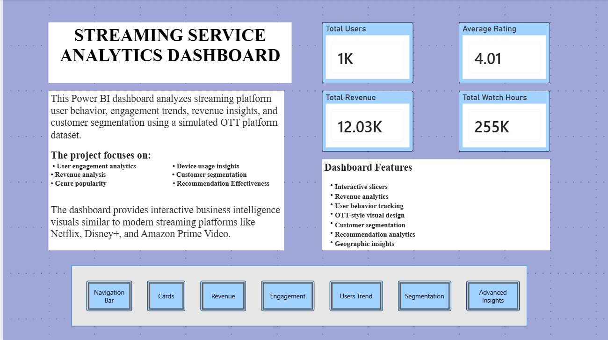
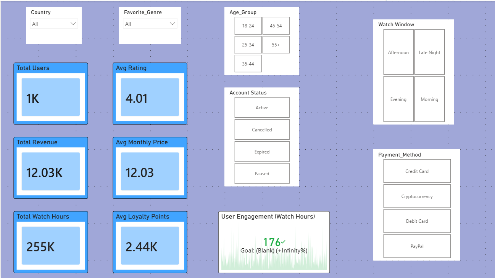
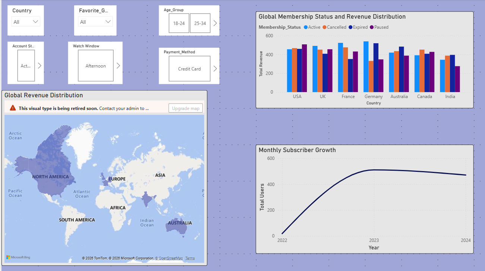
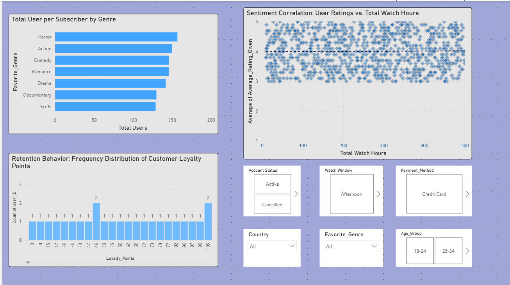
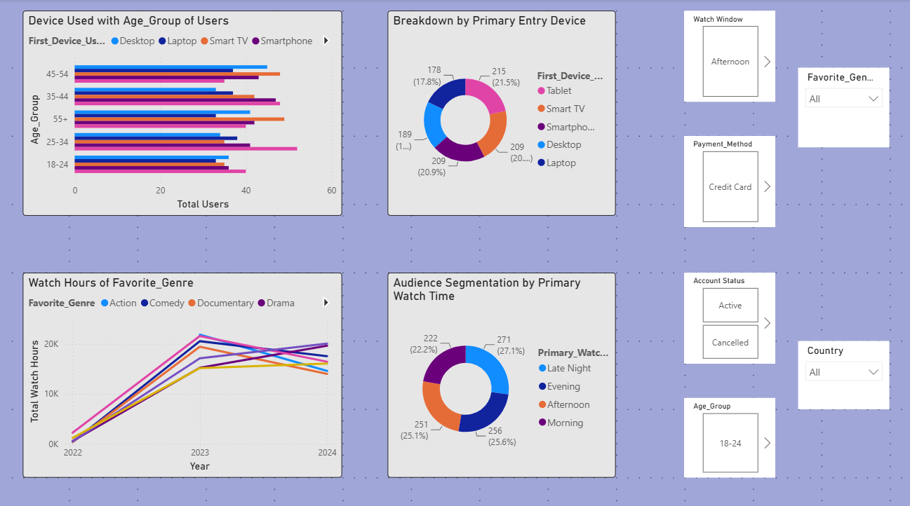
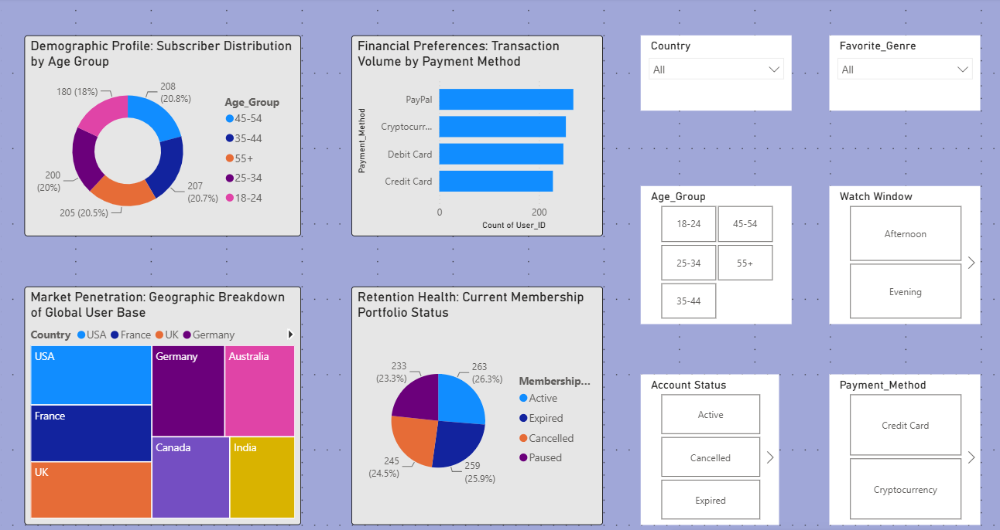
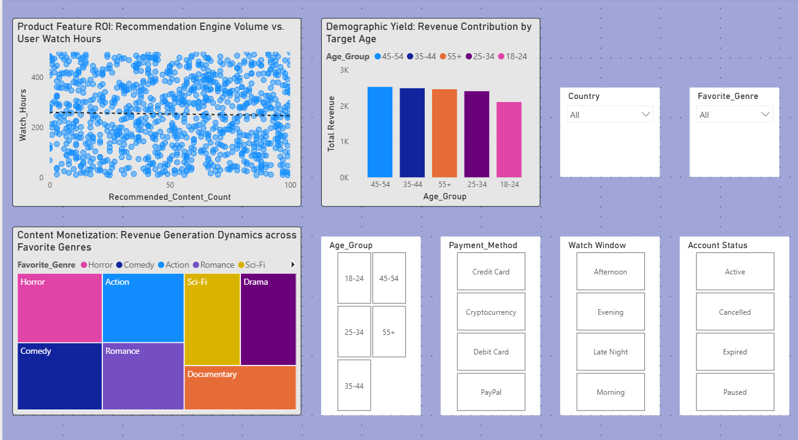

# 🎬 Enterprise OTT Streaming Business Intelligence & Customer Analytics Platform

### End-to-End Data Analytics | Business Intelligence | Power BI | Python | Excel

*A complete Business Intelligence case study demonstrating data preprocessing, exploratory data analysis (EDA), KPI engineering, interactive dashboard development, and business recommendations for an OTT streaming platform.*

---

⭐ Interactive Dashboard  
📈 Executive KPIs  
📊 Business Intelligence Reporting  
📉 Statistical Analysis  
🎯 Data-Driven Decision Making

</div>

---

# 📌 Executive Summary

The **Enterprise OTT Streaming Analytics & Business Intelligence Platform** is an end-to-end analytics project developed to demonstrate how raw business data can be transformed into actionable insights for executive decision-making.

The project analyzes customer behavior, subscription patterns, content consumption, platform engagement, revenue generation, demographic trends, and growth metrics for a simulated OTT streaming platform.

Beginning with data preparation in **Microsoft Excel**, the project progresses through extensive preprocessing and exploratory data analysis using **Python**, followed by KPI engineering, statistical analysis, business insight generation, and the development of an interactive executive dashboard using **Power BI**.

Rather than focusing solely on visualizations, this project emphasizes the complete analytical workflow that organizations use to transform operational data into strategic business decisions.

---

# 💼 Business Problem

Modern OTT streaming platforms generate large volumes of customer interaction data every day.

This data includes:

- User demographics
- Subscription activity
- Watch behavior
- Revenue transactions
- Content engagement
- Platform growth metrics
- Customer ratings
- Loyalty information

Without structured analytics, organizations struggle to answer critical business questions such as:

- Which genres generate the highest engagement?
- Which subscription plans contribute the most revenue?
- How are customer acquisition trends changing over time?
- Which customer segments are most valuable?
- How effectively are platform features driving engagement?
- What business actions can improve customer retention and revenue growth?

This project demonstrates how analytical techniques can convert these business questions into measurable insights that support strategic decision-making.

---

# 🎯 Project Objectives

The primary objective of this project was to build a complete Business Intelligence solution capable of analyzing streaming platform operations from multiple business perspectives.

The project focuses on:

✅ Cleaning and preparing raw business data

✅ Performing exploratory data analysis (EDA)

✅ Engineering business KPIs

✅ Measuring customer engagement

✅ Evaluating subscription revenue

✅ Understanding demographic behavior

✅ Identifying content consumption trends

✅ Performing statistical correlation analysis

✅ Building interactive Power BI dashboards

✅ Producing executive-level business recommendations

---

# 🌟 Why This Project?

After building a strong foundation in **Microsoft Excel**, **Python**, and **Power BI**, I wanted to apply these skills to a realistic business scenario rather than solving isolated technical exercises.

The OTT streaming industry presents an ideal analytical use case because it combines customer behavior, subscription analytics, engagement metrics, revenue analysis, demographic segmentation, and business growth within a single dataset.

The dataset used in this project was inspired by a publicly available Kaggle dataset and further enhanced through additional preprocessing and custom modifications to better simulate real-world business conditions.

The project was developed over approximately **five weeks** alongside academic commitments through iterative development, analysis, visualization, and dashboard refinement.

---

# 🚀 Project Highlights

###  Business Intelligence

- Executive KPI Dashboard
- Revenue Analytics
- User Engagement Analysis
- Customer Segmentation
- Demographic Analysis
- Subscriber Trends
- Platform Growth Analysis

### Python Analytics

- Data Cleaning
- Data Transformation
- Exploratory Data Analysis
- Statistical Analysis
- Correlation Analysis
- Business Insight Generation
- Data Visualization

###  Power BI

- Interactive Dashboard
- Dynamic Slicers
- KPI Cards
- DAX Measures
- Cross Filtering
- Executive Reporting

###  Business Deliverables

- Business Recommendations
- Strategic Insights
- Executive Reporting
- Decision Support Analytics

---

---

# 🏗️ Project Architecture

The project follows a complete end-to-end Business Intelligence workflow, transforming raw streaming platform data into executive-level insights through multiple analytical stages.

```text
                          RAW DATASET (CSV)
                                 │
                                 ▼
                 Microsoft Excel (Initial Validation)
                                 │
                                 ▼
              Data Cleaning & Preprocessing (Python)
                                 │
                                 ▼
            Exploratory Data Analysis (EDA)
                                 │
                                 ▼
             Feature Engineering & KPI Creation
                                 │
                                 ▼
          Statistical Analysis & Correlation Study
                                 │
                                 ▼
         Business Insights & Recommendation Engine
                                 │
                                 ▼
            Power BI Dashboard Development
                                 │
                                 ▼
         Executive Business Intelligence Reporting
```

The workflow was designed to simulate a real-world analytics pipeline, where raw operational data is progressively transformed into strategic business intelligence that supports executive decision-making.

---

# 🛠️ Technology Stack

The project combines multiple analytics tools, each serving a specific role in the Business Intelligence lifecycle.

| Category | Technology | Purpose |
|----------|------------|---------|
| Programming Language | Python | Data Analysis & Automation |
| Spreadsheet Software | Microsoft Excel | Initial Data Validation & Formatting |
| Business Intelligence | Power BI | Interactive Dashboard Development |
| Data Manipulation | Pandas | Cleaning, Transformation & Aggregation |
| Numerical Computing | NumPy | Mathematical Operations |
| Data Visualization | Matplotlib | Exploratory Visualizations |
| Statistical Visualization | Seaborn | Correlation & Distribution Analysis |
| Notebook Environment | Jupyter Notebook | Interactive Development |
| Version Control | Git & GitHub | Project Management & Portfolio |

---
# 📂 Repository Structure

ott-streaming-dashboard/
│
├── ├── 📁 dashboard/
│   └── Streaming_Platform_Dashboard.pbix
│
── 📁 data/
│   └── streaming_service_data.csv
│
├── 📁 notebooks/
│   └── ott-streaming-platform.ipynb
│
├── 📁 screenshots/
│   ├── 1_project_overview.png
│   ├── 2_cards_and_kpi.png
│   ├── 3_revenue_trends.png
│   ├── 4_user_engagement_retention.png
│   ├── 5_subscriber_trends.png
│   ├── 6_subscriber_demographics.png
│   └── 7_advanced_monetization.png
│
└── README.md

---

## 📂 Repository Contents

| Folder/File | Description |
|-------------|-------------|
| **dashboard/** | Contains the interactive Power BI Business Intelligence dashboard. |
| **Streaming_Platform_Dashboard.pbix** | Power BI Desktop file containing DAX measures, KPIs, interactive reports, slicers, and dashboard pages. |
| **data/** | Contains the structured OTT streaming platform dataset used throughout the project. |
| **streaming_service_data.csv** | Source dataset containing customer, subscription, revenue, engagement, and demographic information. |
| **notebooks/** | Contains the complete Python-based analytical workflow. |
| **ott-streaming-platform.ipynb** | Jupyter Notebook including data preprocessing, EDA, statistical analysis, KPI engineering, business insights, and visualizations. |
| **screenshots/** | Dashboard screenshots used throughout the README documentation. |

---

# 📊 Dataset Overview

The project uses a structured OTT streaming platform dataset representing user activity, subscription behavior, engagement metrics, demographic information, and revenue data.

The dataset was originally inspired by a public Kaggle dataset and further enhanced through additional preprocessing and custom modifications to simulate more realistic business scenarios.

Approximately **60%** of the original dataset structure was retained, while the remaining **40%** was refined through preprocessing, formatting, validation, and custom enhancements to improve analytical quality.

---

## Dataset Characteristics

The dataset contains multiple business entities, including:

- 👤 Customer Information
- 🎬 Content Consumption
- 💳 Subscription Details
- 💰 Revenue Information
- ⭐ User Ratings
- 📺 Watch Hours
- 📅 Subscription Dates
- 🌍 Geographic Information
- 📱 Device Usage
- 🎯 Membership Plans
- 🎁 Loyalty Points
- 📈 User Activity

These features enable comprehensive analysis across customer behavior, financial performance, platform engagement, and business growth.

---

## Business Questions Addressed

This project was designed to answer several key business questions frequently encountered in streaming platform analytics.

### Customer Analytics

- Who are the platform's most valuable customers?
- Which demographic groups contribute the highest engagement?
- How does customer behavior vary across different age groups?

---

### Content Analytics

- Which genres receive the highest watch hours?
- Which content categories drive long-term engagement?
- What type of content should the platform invest in?

---

### Revenue Analytics

- Which subscription plan generates the highest revenue?
- How does revenue vary across customer segments?
- What opportunities exist for subscription optimization?

---

### Growth Analytics

- How has subscriber acquisition changed over time?
- Which months experience the highest customer growth?
- What trends indicate future platform expansion?

---

### Customer Satisfaction

- Is there a relationship between watch hours and customer ratings?
- Which users demonstrate the highest platform loyalty?
- Which factors contribute to stronger customer retention?

---

# 📋 Analytical Workflow

The project follows a structured Business Intelligence methodology consisting of multiple analytical stages.

### Phase 1 — Data Collection

- Dataset acquisition
- Data validation
- Structure verification

---

### Phase 2 — Data Preparation

- Missing value handling
- Duplicate checking
- Date formatting
- Data type conversion
- Feature standardization

---

### Phase 3 — Exploratory Data Analysis

- Descriptive statistics
- Distribution analysis
- Trend analysis
- Category analysis
- Correlation analysis

---

### Phase 4 — KPI Engineering

Creation of business metrics such as:

- Total Revenue
- Total Users
- Total Watch Hours
- Average Rating
- Average Monthly Price
- Average Loyalty Points
- Average Watch Hours
- Target Watch Hours

---

### Phase 5 — Dashboard Development

Building interactive Power BI dashboards featuring:

- Executive KPIs
- Interactive Slicers
- Drill-down Analysis
- Cross-filtering
- Dynamic Visualizations
- Business Storytelling

---

### Phase 6 — Business Recommendation

The final stage translates analytical findings into strategic recommendations for:

- Content acquisition strategy
- Revenue optimization
- Customer engagement
- Subscription growth
- User retention
- Platform expansion

---

# 🎯 Skills Demonstrated

This project demonstrates practical experience across the complete Data Analytics workflow.

### Technical Skills

- Microsoft Excel
- Python
- Pandas
- NumPy
- Matplotlib
- Seaborn
- Power BI
- DAX
- Data Cleaning
- Data Transformation
- Exploratory Data Analysis
- KPI Engineering
- Dashboard Development

---

### Business Skills

- Business Intelligence
- Customer Analytics
- Revenue Analytics
- User Segmentation
- Executive Reporting
- Data Storytelling
- Decision Support
- Strategic Recommendation Development

---

---

# 📊 Business Intelligence Dashboard

After completing the data preparation, exploratory analysis, KPI engineering, and statistical evaluation in Python, the analytical findings were transformed into an interactive **Power BI Business Intelligence Dashboard**.

Rather than presenting static charts, the dashboard was designed to help stakeholders explore customer behavior, subscription performance, revenue trends, demographic segmentation, and business growth through interactive visualizations.

> **📖 Note:** The following dashboards are designed as an interactive Business Intelligence reporting solution. Each page focuses on a different business domain, enabling stakeholders to explore customer behavior, revenue trends, engagement metrics, demographic segmentation, and monetization opportunities through dynamic visualizations, filters, and slicers.

---

# 🗂️ Dashboard Navigation

The dashboard follows a logical analytical workflow.

```text
Project Overview
        ↓
Executive KPI Dashboard
        ↓
Revenue Trends
        ↓
User Engagement & Retention
        ↓
Subscriber Trends
        ↓
Subscriber Demographics & Portfolio Segmentation
        ↓
Advanced Monetization & Feature Effectiveness
```

Each dashboard builds upon the previous one, creating a complete business story from overall platform health to detailed strategic recommendations.

---

# 📖 1. Project Overview

## 🎯 Business Objective

The Project Overview page introduces the objectives, business use case, dashboard features, and high-level platform KPIs.

It serves as an introduction for users before they begin exploring the analytical dashboards.

<p align="center">

</p>

<p align="center">
<i><b>Figure 1.</b> Project Overview dashboard introducing the Business Intelligence solution, project objectives, dashboard features, and executive summary KPIs.</i>
</p>

### 📌 Overview Includes

- Project description
- Business objectives
- Dashboard features
- Navigation buttons
- Executive KPI summary
- Platform overview

### 💡 Business Value

This page provides stakeholders with context before exploring the analytical dashboards, ensuring they understand the business objectives, reporting structure, and overall purpose of the project.

---

# 📊 2. Executive KPI Dashboard

## 🎯 Business Objective

The Executive KPI Dashboard provides a consolidated overview of platform performance through high-level business metrics.

It enables stakeholders to monitor the overall health of the OTT platform without navigating through multiple reports.

<p align="center">

</p>

<p align="center">
<i><b>Figure 2.</b> Executive KPI Dashboard displaying platform-wide performance indicators, customer engagement metrics, subscription statistics, and interactive filtering options.</i>
</p>

### 📌 KPIs Displayed

- 👥 Total Users
- 💰 Total Revenue
- 📺 Total Watch Hours
- ⭐ Average Rating
- 💳 Average Monthly Subscription Price
- 🎁 Average Loyalty Points
- ⏱️ Average Watch Hours

### 📈 Interactive Filters

- Country
- Favorite Genre
- Age Group
- Watch Window
- Account Status
- Payment Method

### 💡 Business Value

This dashboard acts as the executive reporting layer, allowing decision-makers to quickly evaluate platform performance before performing detailed analysis.

---

# 💰 3. Revenue Trends Dashboard

## 🎯 Business Objective

Revenue is one of the most critical business metrics for any subscription-based platform.

This dashboard analyzes how subscription revenue is distributed across different countries, membership plans, and time periods.

<p align="center">

</p>

<p align="center">
<i><b>Figure 3.</b> Revenue Trends Dashboard illustrating geographic revenue distribution, membership status comparison, and monthly subscriber growth trends.</i>
</p>

### 📊 Visualizations Included

- 🌍 Global Revenue Distribution Map
- 📊 Membership Status vs Revenue Comparison
- 📈 Monthly Subscriber Growth Trend

### 🎛️ Interactive Filters

- Country
- Favorite Genre
- Age Group
- Account Status
- Watch Window
- Payment Method

### 💡 Business Value

The dashboard enables business stakeholders to identify high-performing markets, compare revenue across subscription plans, and monitor customer growth over time.

---

# 👥 4. User Engagement & Retention Analytics

## 🎯 Business Objective

Understanding customer engagement is essential for improving retention and maximizing customer lifetime value.

This dashboard analyzes user behavior, watch hours, loyalty, and the relationship between platform engagement and customer satisfaction.

<p align="center">

</p>

<p align="center">
<i><b>Figure 4.</b> User Engagement & Retention Analytics dashboard showing genre popularity, watch-hour behavior, rating correlation, and customer loyalty analysis.</i>
</p>

### 📊 Visualizations Included

- 📊 Total Users by Favorite Genre
- 📈 User Ratings vs Total Watch Hours (Scatter Plot)
- 📉 Loyalty Points Distribution

### 🎛️ Interactive Filters

- Account Status
- Watch Window
- Payment Method
- Country
- Favorite Genre
- Age Group

### 💡 Business Value

This dashboard helps identify customer engagement patterns, evaluate retention behavior, and understand how viewing activity relates to customer satisfaction.

---

---

# 📈 5. Subscriber Trends Dashboard

## 🎯 Business Objective

Sustainable growth is one of the primary objectives of any subscription-based streaming platform.

This dashboard analyzes subscriber acquisition trends, membership distribution, and platform growth over time to help stakeholders understand customer expansion and identify periods of high or low subscriber growth.

<p align="center">

</p>

<p align="center">
<i><b>Figure 5.</b> Subscriber Trends Dashboard highlighting customer acquisition patterns, membership distribution, subscription growth, and user expansion over time.</i>
</p>

### 📊 Visualizations Included

- 📈 Monthly Subscriber Growth Trend
- 📊 Membership Plan Distribution
- 👥 Subscriber Growth Analysis
- 📅 Monthly Subscription Overview

### 🎛️ Interactive Filters

- Country
- Age Group
- Favorite Genre
- Account Status
- Payment Method
- Watch Window

### 💡 Key Business Insights

- Identifies periods of rapid subscriber acquisition.
- Highlights the most popular subscription plans.
- Reveals long-term platform growth trends.
- Supports future customer acquisition planning.

### 🚀 Business Value

Business leaders can use this dashboard to evaluate growth performance, identify successful acquisition periods, and improve future subscription strategies.

---

# 🌍 6. Subscriber Demographics & Portfolio Segmentation

## 🎯 Business Objective

Understanding customer demographics helps organizations personalize user experiences, optimize marketing campaigns, and improve content recommendations.

This dashboard provides a comprehensive view of customer segmentation based on demographic and behavioral attributes.

<p align="center">

</p>

<p align="center">
<i><b>Figure 6.</b> Subscriber Demographics Dashboard illustrating customer segmentation across age groups, gender, geography, membership plans, and viewing preferences.</i>
</p>

### 📊 Visualizations Included

- 🌍 Geographic Distribution
- 👥 Age Group Analysis
- 🚻 Gender Distribution
- 📱 Device Preference Analysis
- 🎬 Favorite Genre Distribution
- 💳 Membership Segmentation

### 🎛️ Interactive Filters

- Country
- Gender
- Favorite Genre
- Membership Plan
- Payment Method
- Watch Window

### 💡 Key Business Insights

- Identifies high-value customer segments.
- Highlights regional audience differences.
- Shows demographic viewing preferences.
- Supports personalized marketing strategies.
- Improves customer targeting.

### 🚀 Business Value

This dashboard enables businesses to better understand their audience and create more personalized marketing campaigns, content strategies, and customer engagement initiatives.

---

# 🚀 7. Advanced Monetization & Feature Effectiveness Dashboard

## 🎯 Business Objective

Beyond customer acquisition and engagement, long-term platform success depends on effective monetization strategies and feature performance.

This dashboard evaluates revenue optimization opportunities while measuring how platform features contribute to customer engagement and business growth.

<p align="center">

</p>

<p align="center">
<i><b>Figure 7.</b> Advanced Monetization & Feature Effectiveness Dashboard presenting monetization opportunities, feature performance analysis, and strategic business indicators.</i>
</p>

### 📊 Visualizations Included

- 💰 Revenue Optimization Metrics
- 📈 Feature Performance Analysis
- 🎯 Customer Value Indicators
- 📊 Monetization Comparisons
- 📉 Strategic Business KPIs

### 🎛️ Interactive Filters

- Country
- Membership Plan
- Favorite Genre
- Payment Method
- Age Group
- Account Status

### 💡 Key Business Insights

- Identifies opportunities to increase platform revenue.
- Evaluates customer value across different subscription segments.
- Highlights feature effectiveness.
- Supports long-term monetization planning.
- Assists executive decision-making.

### 🚀 Business Value

The dashboard provides strategic insights that help businesses maximize profitability while improving customer satisfaction and long-term platform sustainability.

---

# ⚡ Interactive Dashboard Features

The dashboard was designed to provide an intuitive Business Intelligence experience through interactive reporting and dynamic exploration.

### Key Features

- ✅ Interactive Slicers
- ✅ Dynamic Cross-Filtering
- ✅ Multi-Page Navigation
- ✅ Responsive KPI Cards
- ✅ Drill-Down Visual Analysis
- ✅ Business-Oriented Layout
- ✅ Executive Reporting Interface

These interactive capabilities allow stakeholders to explore the data from multiple perspectives without modifying the underlying dataset.

---

# 📖 Dashboard Storytelling Approach

Rather than presenting isolated charts, the dashboard follows a structured storytelling approach.

```text
Project Overview
        ↓
Platform Performance
        ↓
Revenue Analysis
        ↓
Customer Engagement
        ↓
Subscriber Growth
        ↓
Customer Segmentation
        ↓
Revenue Optimization
        ↓
Business Recommendations
```

Each dashboard page answers a different business question while naturally leading the user toward strategic decision-making.

---

# 🏆 Dashboard Outcome

The final Power BI dashboard successfully transforms raw analytical findings into a complete Business Intelligence reporting solution.

The dashboard enables stakeholders to:

- Monitor overall platform performance.
- Analyze customer engagement.
- Track subscription growth.
- Evaluate revenue trends.
- Understand audience demographics.
- Explore monetization opportunities.
- Support strategic business decisions through interactive reporting.

By combining analytical insights with intuitive visual storytelling, the dashboard demonstrates how Business Intelligence tools can convert complex data into actionable business knowledge.

---

---

# 📦 Project Deliverables

| Deliverable | Description |
|-------------|-------------|
| 📒 **Python Notebook** | Complete end-to-end analytics workflow including data preprocessing, exploratory data analysis (EDA), statistical analysis, KPI engineering, business insights, and visualizations. |
| 📊 **Dataset (CSV)** | Structured OTT streaming platform dataset used for customer, subscription, revenue, engagement, and demographic analysis. |
| 📈 **Power BI Dashboard (.pbix)** | Interactive Business Intelligence dashboard featuring executive KPIs, DAX measures, customer analytics, revenue analysis, subscriber trends, demographic segmentation, and monetization insights. |
| 📄 **Project Documentation** | Comprehensive GitHub case study documenting the business problem, analytical workflow, dashboard development, insights, and strategic recommendations. |
| 🎥 **Dashboard Walkthrough** | Video demonstration showcasing the interactive Power BI dashboard, navigation, slicers, filters, and reporting capabilities. |

---

# 📦 Project Deliverables

| Deliverable | Description |
|-------------|-------------|
| 📒 **Python Notebook** | Complete end-to-end analytics workflow including data preprocessing, exploratory data analysis (EDA), statistical analysis, KPI engineering, business insights, and visualizations. |
| 📊 **Dataset (CSV)** | Structured OTT streaming platform dataset used throughout the project for customer, subscription, revenue, and engagement analysis. |
| 📗 **Excel Workbook** | Initial data validation, formatting, preprocessing, and data preparation before Python analysis. |
| 📈 **Power BI Dashboard** | Interactive Business Intelligence dashboard containing executive KPIs, revenue analysis, customer analytics, subscriber trends, demographic segmentation, and monetization insights. |
| 📄 **Project Documentation** | Complete GitHub case study explaining the business problem, analytical workflow, dashboard development, insights, and recommendations. |
| 🎥 **Dashboard Walkthrough** | Silent demonstration showcasing the interactive Power BI dashboard, navigation, slicers, filters, and Business Intelligence reporting experience. |

---

## 🔗 Access Project Assets

| Resource | Link |
|----------|------|
| 📒 Python Notebook | [`ott-streaming-platform.ipynb`](notebooks/ott-streaming-platform.ipynb) |
| 📊 Dataset | [`streaming_service_data.csv`](data/streaming_service_data.csv) |
| 📈 Power BI Dashboard | [`Streaming_Platform_Dashboard.pbix`](dashboard/Streaming_Platform_Dashboard.pbix) |
| 🎥 Dashboard Walkthrough | **[▶ Watch Power BI Dashboard Demo](https://drive.google.com/file/d/1zg2HGlrUExk5zCjRtMdK1k5geEIWZ7Jn/view?usp=sharing)** |


> ## 📌 Recruiter Note
>
> If you're reviewing this project from a technical or business perspective, the following order provides the best understanding of the complete analytical workflow:
>
> **1. Executive KPI Dashboard** → Understand the business overview.
>
> **2. Python Notebook** → Explore the complete analytical workflow including preprocessing, EDA, KPI engineering, and statistical analysis.
>
> **3. Dashboard Walkthrough** → Experience the interactive Business Intelligence solution.
>
> **4. Dataset & Excel Workbook** → Review the underlying data and preprocessing steps.
>
> Following this sequence demonstrates how raw business data was transformed into actionable insights and executive-level reporting.

---

# 🎥 Interactive Dashboard Walkthrough

The dashboard walkthrough demonstrates how the Business Intelligence solution can be explored through interactive navigation, dynamic filtering, synchronized slicers, and executive reporting.

Although the walkthrough is presented without narration, the following guide explains what is demonstrated throughout the video.

---

## 📍 Walkthrough Guide

### 🌐 1. Navigation & User Experience

The walkthrough begins with the custom navigation system, demonstrating smooth movement across multiple analytical dashboard pages.

This showcases the overall user experience, report organization, and intuitive Business Intelligence interface.

**Highlights**

- Dashboard navigation
- User interface consistency
- Reporting layout
- Executive dashboard experience

---

### 📊 2. Dashboard Architecture

The overall dashboard structure is introduced, providing a complete overview of how the Business Intelligence solution is organized.

This demonstrates the logical progression from executive KPIs to detailed business analysis.

**Highlights**

- Dashboard organization
- KPI placement
- Visual hierarchy
- Reporting structure

---

### 🎛️ 3. Dynamic Slicers & Interactive Filtering

Interactive slicers allow users to instantly update every connected visualization across the dashboard.

This demonstrates responsive data exploration without modifying the underlying dataset.

**Interactive Filters**

- 🌍 Country
- 👥 Age Group
- 🎬 Favorite Genre
- 💳 Membership Plan
- 💰 Payment Method
- ⏰ Watch Window

---

### 🔄 4. Cross-Filtering & Interactive Exploration

The walkthrough demonstrates how selecting values within one visualization dynamically updates related reports.

This interactive behavior enables users to explore relationships between customer demographics, subscriptions, engagement, and revenue.

---

### 📈 5. Complete Dashboard Walkthrough

The demonstration continues through each analytical dashboard:

- 📖 Project Overview
- 📊 Executive KPI Dashboard
- 💰 Revenue Trends
- 👥 User Engagement & Retention
- 📈 Subscriber Trends
- 🌍 Subscriber Demographics & Portfolio Segmentation
- 🚀 Advanced Monetization & Feature Effectiveness

Each page answers a different business question while contributing to the overall analytical story.

---

### ✅ 6. Final Dashboard Review

The walkthrough concludes with a complete review of the Business Intelligence solution.

This final overview highlights:

- Dashboard consistency
- Interactive capabilities
- Reporting quality
- Professional dashboard design
- Executive-level user experience

---

## 🎯 Purpose of the Demonstration

The purpose of this walkthrough is not only to showcase dashboard design but also to demonstrate how Business Intelligence transforms analytical findings into interactive decision-support tools.

Rather than presenting static charts, the dashboard enables stakeholders to explore business performance, investigate trends, compare customer segments, and generate actionable insights through an intuitive reporting experience.

---

# 📌 From Dashboards to Decisions

The dashboards presented above summarize analytical findings across customer behavior, subscription performance, revenue trends, engagement metrics, demographic segmentation, and monetization opportunities.

However, dashboards alone do not create business value.

The true purpose of data analytics is to convert observations into actionable insights that support strategic decision-making.

The following section presents the key business insights discovered during the analysis, followed by practical recommendations that could help improve customer engagement, optimize subscription revenue, strengthen content strategy, and support long-term platform growth.

---

---

# ⚠️ Challenges Faced & How I Solved Them

This project was my first end-to-end Data Analytics and Business Intelligence project.

Although I had completed certifications in Microsoft Excel, Python, and Power BI before starting this project, applying those skills to a real business problem was a completely different experience.

Throughout the project, I faced several practical challenges that helped me strengthen both my technical knowledge and analytical thinking.

---

## 🧹 1. Preparing a Realistic Dataset

### Challenge

The dataset used in this project was inspired by a public Kaggle dataset.

However, I wanted to understand how real business datasets are structured instead of relying entirely on publicly available data.

This required reviewing the dataset carefully and making my own modifications to improve its analytical quality.

### How I Solved It

I independently refined approximately **40% of the dataset** while retaining the remaining structure from the original source.

During this process I:

- Validated the dataset structure.
- Corrected date formats using **Format Cells** and **Text to Columns** in Excel.
- Organized inconsistent values.
- Performed preprocessing before importing the data into Python.

This process helped me better understand how raw business data is prepared before analysis begins.

---

## 🔗 2. Understanding Relationships Between Columns

### Challenge

One of the biggest challenges was understanding how different columns were related to one another.

Initially, connecting customer information, subscription details, engagement metrics, revenue, and demographic attributes into one meaningful analytical workflow was confusing.

I realized that if these relationships were not understood correctly, the final analysis and business insights would also be inaccurate.

### How I Solved It

Instead of immediately creating visualizations, I spent time understanding what every column represented and how different variables interacted with each other.

Once those relationships became clear, it became much easier to answer business questions and build meaningful dashboards.

This experience improved my analytical thinking much more than simply learning new tools.

---

## 🤖 3. Developing Meaningful Recommendation Logic

### Challenge

The most technically challenging part of this project was designing the recommendation logic and ensuring that the analytical results could realistically support business decisions.

I wanted the recommendations to reflect how an actual OTT streaming platform might analyze customer behavior instead of generating generic observations.

### How I Solved It

I focused on validating correlations, reviewing engagement patterns, analyzing subscription behavior, and connecting multiple analytical findings before writing any business recommendations.

This taught me that effective analytics is not only about creating charts—it is about interpreting data correctly and providing recommendations that businesses can confidently use.

---

## 📊 4. Building an Interactive Dashboard

### Challenge

Creating charts was relatively straightforward compared to designing an interactive dashboard that users could easily explore.

I wanted the dashboard to feel intuitive, organized, and useful for business users rather than simply displaying multiple visualizations on a page.

### How I Solved It

I divided the dashboard into multiple analytical pages, each focusing on a specific business area such as:

- Executive KPIs
- Revenue Analysis
- User Engagement
- Subscriber Trends
- Customer Demographics
- Monetization Analysis

I also implemented interactive slicers and cross-filtering so users could explore the data from different perspectives.

This became my favorite part of the project because it transformed the analysis into a practical Business Intelligence solution.

---

# 📚 Key Learnings

Working on this project helped me understand that successful Data Analytics involves much more than writing code or creating dashboards.

Throughout this project I learned how to:

- Prepare and clean real-world datasets.
- Apply Excel, Python, and Power BI together within a single workflow.
- Perform Exploratory Data Analysis (EDA).
- Interpret customer behavior through data.
- Engineer meaningful business KPIs.
- Build interactive Business Intelligence dashboards.
- Convert analytical findings into business recommendations.
- Present insights through clear data storytelling.

More importantly, I learned that dashboards are valuable only when they help decision-makers answer business questions and take informed actions.

---

# 🚀 Continuous Learning & Future Direction

This project marks the beginning of my practical journey in Data Analytics and Business Intelligence.

Rather than revisiting this project immediately, my current focus is on building new projects that challenge me to learn additional tools, explore more advanced analytical techniques, and solve increasingly complex business problems.

Each project in my portfolio is designed to build upon the previous one, allowing me to continuously strengthen my skills in data preparation, statistical analysis, Business Intelligence, and data storytelling.

Although I do not currently plan to develop a Version 2 of this project, the knowledge and experience gained from it continue to influence how I approach every new analytics project.

My objective is to create a portfolio that clearly demonstrates continuous learning, technical growth, and the ability to solve real-world business problems through data.


---

# 💼 Skills Strengthened Through This Project

### Technical Skills

- Microsoft Excel
- Python
- Pandas
- NumPy
- Matplotlib
- Seaborn
- Power BI
- DAX
- Git & GitHub

### Analytical Skills

- Data Cleaning
- Exploratory Data Analysis (EDA)
- Statistical Analysis
- KPI Engineering
- Business Intelligence
- Dashboard Development
- Data Storytelling
- Business Recommendation Development

### Professional Skills

- Analytical Thinking
- Problem Solving
- Attention to Detail
- Business Communication
- Documentation
- Continuous Learning

---

> **📌 Portfolio Philosophy**
>
> I believe a strong portfolio should demonstrate continuous growth rather than repeated variations of the same project.
>
> For that reason, instead of creating multiple versions of a single project, I aim to build diverse analytics case studies across different business domains, with each project introducing new tools, techniques, and business challenges.
>
> My goal is to create a portfolio that reflects both technical progression and a deeper understanding of how data can support real-world business decision-making.

---

---

# 🚀 Getting Started

If you'd like to explore, reproduce, or learn from this project, follow the steps below.

---

## ## 📂 Project Structure

```text
ott-streaming-dashboard/
│── 📁 dashboard/
│   └── Streaming_Platform_Dashboard.pbix
│
├── 📁 data/
│   └── streaming_service_data.csv
│
├── 📁 notebooks/
│   └── ott-streaming-platform.ipynb
│
├── 📁 screenshots/
│   ├── 1_project_overview.png
│   ├── 2_cards_and_kpi.png
│   ├── 3_revenue_trends.png
│   ├── 4_user_engagement_retention.png
│   ├── 5_subscriber_trends.png
│   ├── 6_subscriber_demographics.png
│   └── 7_advanced_monetization.png
│
└── README.md
```

---

# 💻 Software Requirements

To explore this project, the following software is recommended:

| Software | Purpose |
|----------|---------|
| Microsoft Excel | Initial data validation & preprocessing |
| Python 3.x | Data preprocessing & analysis |
| Jupyter Notebook | Running the analytical workflow |
| Power BI Desktop | Viewing and interacting with the dashboard |
| Git | Version control |
| GitHub | Repository hosting |

---

# 📦 Python Libraries

Install the required libraries before running the notebook.

```bash
pip install pandas numpy matplotlib seaborn
```

---

# ▶️ Running the Project

### Step 1

Clone the repository.

```bash
git clone https://github.com/Jahanvi-Rana/jahanvi-analytics-portfolio.git
```

---

### Step 2

Navigate to the project folder.

```bash
cd projects/projects/ott-streaming-dashboard
```

---

### Step 3

Open the Jupyter Notebook.

```bash
jupyter notebook
```

Open:

```text
ott-streaming-platform.ipynb
```

---

### Step 4

Run all notebook cells sequentially to reproduce the complete analytical workflow.

---

### Step 5

Open the Power BI Dashboard.

```text
dashboard/Streaming_Platform_Dashboard.pbix
```

(If Power BI Desktop is installed.)

---

# 📊 Project Outputs

After successfully running the project, you will be able to explore:

- 📈 Exploratory Data Analysis (EDA)
- 📊 Statistical Analysis
- 📌 KPI Engineering
- 📉 Business Insights
- 📊 Power BI Dashboard
- 🚀 Strategic Business Recommendations

---

# 📁 Dataset Information

**Dataset Inspiration**

Public Kaggle Dataset (modified and enhanced for this project).

**Dataset Type**

OTT Streaming Platform Analytics

**Business Domain**

Entertainment & Media Analytics

**Data Processing**

- Data Validation
- Date Formatting
- Data Cleaning
- Data Preparation
- Exploratory Data Analysis
- KPI Engineering

---

# 🤝 Let's Connect

Thank you for taking the time to explore this project.

This project represents an important milestone in my Data Analytics journey and reflects my continuous effort to improve both my technical and analytical skills.

I always welcome constructive feedback, project discussions, collaboration opportunities, and conversations related to Data Analytics, Business Intelligence, and Data Visualization.

If you'd like to connect, discuss ideas, or simply say hello, feel free to reach out through any of the platforms below.

---

# 👩‍💻 About the Author

**Jahanvi Rana**

Data Analytics | Business Intelligence | Power BI Developer

🎯 Passionate about transforming raw data into meaningful business insights through analytics, visualization, and storytelling.

Currently focused on building practical, business-oriented Data Analytics projects while continuously expanding my skills in Business Intelligence, Python, SQL, and data-driven decision-making.

---

# 📬 Connect With Me

| Platform | Link |
|----------|------|
| 💼 LinkedIn | https://www.linkedin.com/in/jahanvirana/ |
| 💻 GitHub | https://github.com/Jahanvi-Rana |
| 📊 Kaggle | https://www.kaggle.com/ranajahanvi |
| 🌐 Portfolio | https://github.com/Jahanvi-Rana/jahanvi-analytics-portfolio |
| 📧 Email | your-email@example.com |

> **Note:** Replace the email address above with your preferred professional contact email.

---

# 💬 Feedback & Suggestions

Every project is an opportunity to learn and improve.

If you have suggestions for improving the analysis, dashboard design, documentation, or Business Intelligence approach, I'd genuinely appreciate your feedback.

Constructive feedback helps me continue growing as a Data Analyst.

---

# ⭐ Support This Project

If you found this project useful, insightful, or inspiring, please consider giving it a ⭐ on GitHub.

Your support motivates me to continue building high-quality Data Analytics and Business Intelligence projects.

---

# 📄 License

This project is intended for educational, learning, and portfolio purposes.

Please provide appropriate credit if you reference or adapt any part of this work.

---

# 🙏 Thank You

Thank you for taking the time to explore this project.

I hope this repository demonstrates not only my technical skills but also my approach to solving business problems through data.

This project marks the beginning of my journey in Data Analytics, and I look forward to continuing that journey by building increasingly impactful analytics solutions.

**Happy Exploring! 🚀**

---
